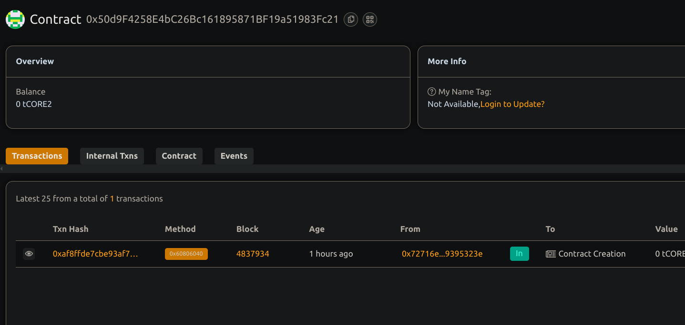

## Algorithmic Stablecoin with Price Stability

## Project Title
Algorithmic Stablecoin with Price Stability

## Project Description

This project implement an algorithmic stablecoin on Ethereum-compatible networks that maintains price stability via supply adjustments. It integrates a price oracle and automatically mints or burns tokens to keep the stablecoin pegged to a target price (e.g., $1).

## Project Vision

To create a decentralized, trustless stablecoin that maintains price stability without relying on collateral alone, providing a scalable and resilient digital currency.

## Key Features
- ERC20 token compliant stablecoin.
- Integration with an external price oracle for real-time price feeds.
- Automated supply adjustments (minting/burning) to stabilize price.
- Mint and redeem stablecoins against ETH (simplified).
- Owner-controlled parameters for adjustment factor and target price.

## Future Scopes
- Integration with decentralized oracles like Chainlink or Band Protocol.rt
- Advanced collateral management with multiple asset support.
- Governance mechanism to allow decentralized parameter tuning.
- Implementation of dynamic adjustment factors based on market volatility.
- Auditing and security enhancements for production deployment.

## Contract details
0x50d9F4258E4bC26Bc161895871BF19a51983Fc21
this project is created  by Deepshikha verma
